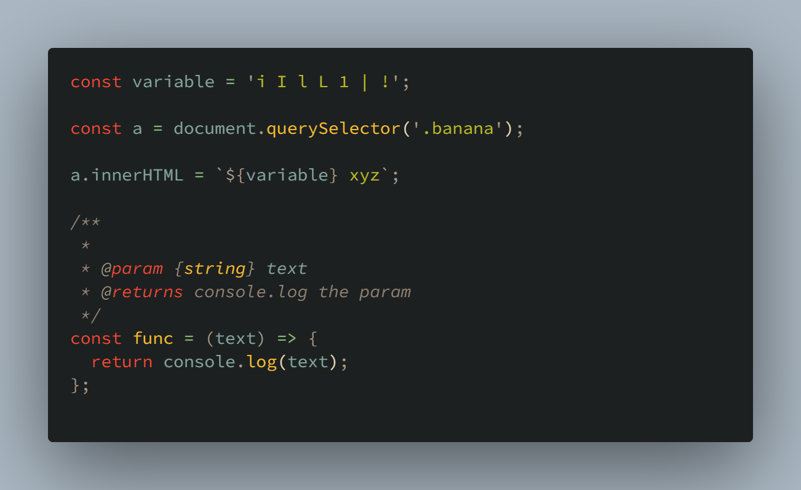

## Emphasis

### Bold

|Markdown |	HTML |	Rendered Output |
|:--|:--|:--|
|<code>I just love &ast;&ast;bold text&ast;&ast;.</code> | <code>I just love &lt;strong>bold text&lt;/strong>.</code> | I just love **bold** text.|
|<code>I just love &#95;&#95;bold text&#95;&#95;.</code> | <code>I just love &lt;strong>bold text&lt;/strong>.</code> | I just love __bold__ text.|
|<code>Love&ast;&ast;is&ast;&ast;bold</code> | <code>Love&lt;strong>is&lt;/strong>bold</code> | Love**is**bold|

### Italic

|Markdown |	HTML |	Rendered Output |
|:--|:--|:--|
|<code>Italicized text is the &ast;cat's meow&ast;.</code> | <code>Italicized text is the &lt;em>cat's meow&lt;/em>.</code> | Italicized text is the *cat’s meow*.|
|<code>Italicized text is the &#95;cat's meow&#95;.</code> | <code>Italicized text is the &lt;em>cat's meow&lt;/em>.</code> | Italicized text is the _cat’s meow_.|
|<code>A&ast;cat&ast;meow</code> | <code>Love&lt;em>is&lt;/em>bold</code> | A*cat*meowd|

Aliqua consequat `asd`labore voluptate ad.

## Blockquotes

```markdown
> In deserunt cillum nostrud culpa culpa fugiat et non.  
> Ea labore ut nisi non ad nostrud ut nisi irure dolor dolor duis ullamco.  
> Excepteur tempor deserunt qui aliquip ullamco qui incididunt sint pariatur laborum do Lorem.
```

> In deserunt cillum nostrud culpa culpa fugiat et non.  
> Ea labore ut nisi non ad nostrud ut nisi irure dolor dolor duis ullamco.  
> Excepteur tempor deserunt qui aliquip ullamco qui incididunt sint pariatur laborum do Lorem.

## Codeblock

~~~markdown
```js
console.log('banana');
```
~~~

Codeblock with title:

~~~markdown:title=markdown.md
```js:title=app.js
console.log('title');
```
~~~

Codeblock with highlight:

~~~markdown

```javascript{1,6-8}
import React form 'react';

function App() {
  return (
    <div className="App">
      <p>
        Edit <code>src/App.js</code> and save to reload.
      </p>
    </div>
  );
}
export default App;
```
~~~

```javascript{1,6-8}
import React form 'react';

function App() {
  return (
    <div className="App">
      <p>
        Edit <code>src/App.js</code> and save to reload.
      </p>
    </div>
  );
}
export default App;
```

## Image

```markdown

```


## Emoji

:poop:
😀
:smile:
:memo: